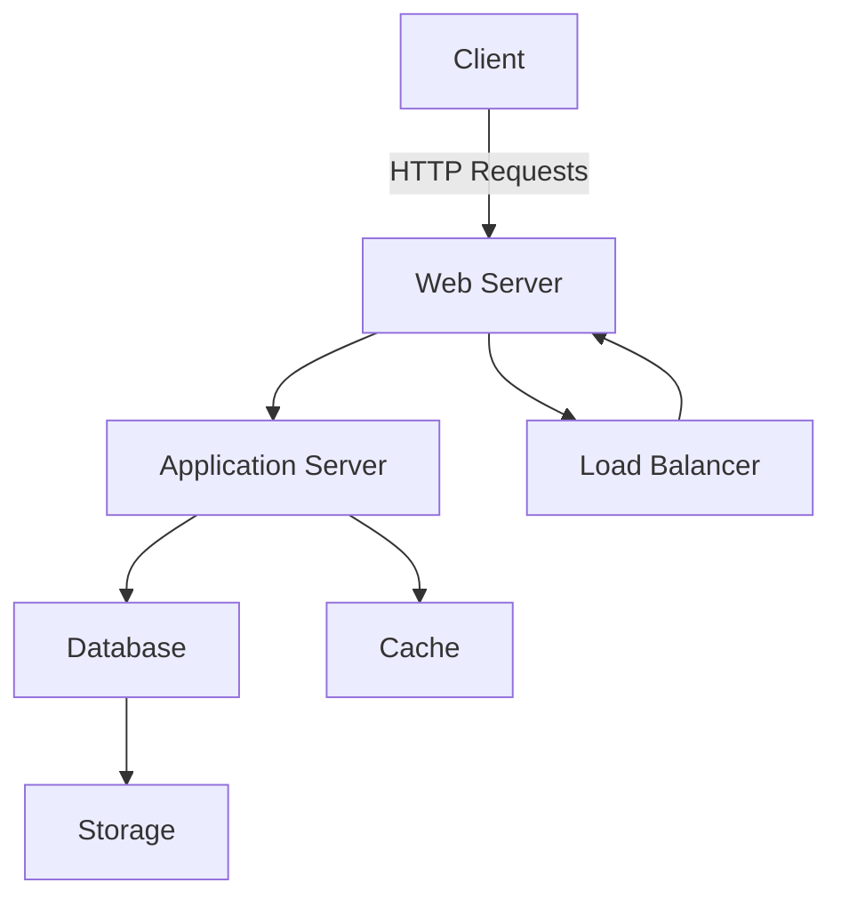

# Web Application Architecture Overview

```mermaid
graph TD;
    A[Client] -->|HTTP Requests| B[Web Server]
    B --> C[Application Server]
    C --> D[Database]
    D --> E[Storage]
    C --> F[Cache]
    B --> G[Load Balancer]
    G --> B
```